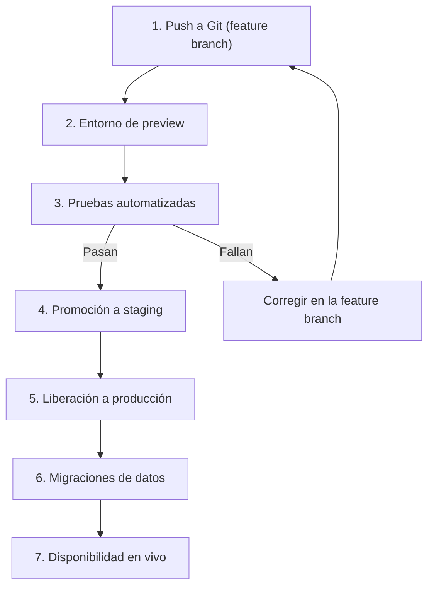

# DataCorp Analytics - Taller DataOps

## Actividad 1: Entornos aislados

### 1.1 Tabla de entornos

| Entorno | Propósito | Acceso | Datos | Infraestructura | Control de código |
|---|---|---|---|---|---|
| DEV | Experimentar y desarrollar modelos sin riesgo | Científicos de datos e ingenieros | Datos sintéticos o muestra anonimizada | Recursos pequeños y baratos | Ramas feature, push libre |
| QA | Validar que todo funciona antes de producción | Equipo de QA y pipeline automático | Copia anonimizada de producción | Réplica reducida de PROD | Solo entra código con Pull Request aprobado |
| PROD | Servir predicciones a clientes reales | Solo el pipeline automático | Datos reales con backups y cifrado | Alta disponibilidad y monitoreo | Rama main protegida |

**Justificación:** los incidentes actuales ocurrieron por trabajar directamente sobre producción. Separar los entornos y usar datos anonimizados en DEV y QA evita que un error afecte a los clientes.

### 1.2 Diagrama del flujo de un cambio

