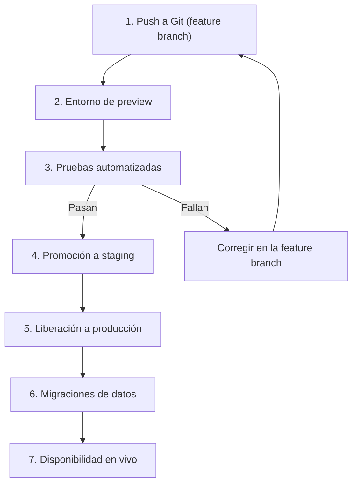
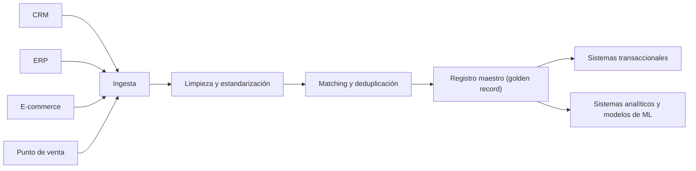
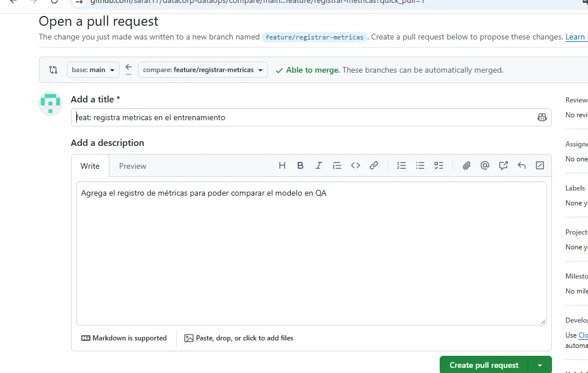
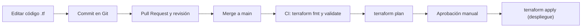
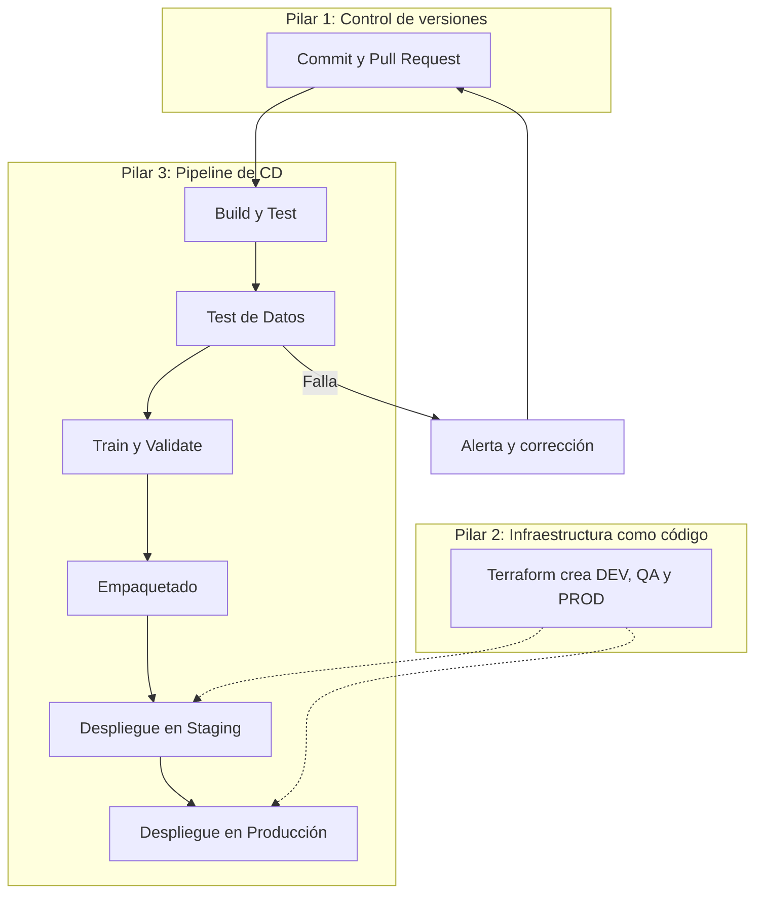

# DataCorp Analytics - Taller DataOps

## Actividad 1: Entornos aislados

### 1.1 Tabla de entornos

| Entorno | Propósito | Acceso | Datos | Infraestructura | Control de código |
|---|---|---|---|---|---|
| DEV | Experimentar y desarrollar modelos sin riesgo | Científicos de datos e ingenieros | Datos sintéticos o muestra anonimizada | Recursos pequeños y baratos | Ramas feature, push libre |
| QA | Validar que todo funciona antes de producción | Equipo de QA y pipeline automático | Copia anonimizada de producción | Réplica reducida de PROD | Solo entra código con Pull Request aprobado |
| PROD | Servir predicciones a clientes reales | Solo el pipeline automático | Datos reales con backups y cifrado | Alta disponibilidad y monitoreo | Rama main protegida |

**Justificación:** los incidentes actuales ocurrieron por trabajar directamente sobre producción. Separar los entornos y usar datos anonimizados en DEV y QA evita que un error afecte a los clientes.

### 1.2 Diagrama del flujo de un cambio



### 1.3 Escenario de error: el modelo falla en QA

**Escenario:** el modelo de predicción de ventas obtiene un error (RMSE) mayor al umbral permitido cuando se prueba en QA.

**Protocolo de actuación:**
1. El pipeline marca la etapa como fallida y **bloquea automáticamente** la promoción a PROD.
2. Se envía una alerta al equipo (Slack o correo).
3. Se crea un issue en GitHub con el log del error.
4. El científico de datos corrige el problema en su rama `feature/*`.
5. Al hacer push, las pruebas se ejecutan de nuevo desde cero.
6. Solo si todo pasa en QA, se aprueba el paso a producción.

## Actividad 2: Implementación de MDM

### 2.1 Entidades maestras

| Entidad | Atributos clave | Fuentes de datos | Reglas de calidad | Data owner |
|---|---|---|---|---|
| Cliente | ID_cliente, nombre, documento, email, teléfono, fecha_alta | CRM, e-commerce, punto de venta | ID único; email válido; sin duplicados; documento obligatorio | Director Comercial |
| Producto | SKU, nombre, categoría, precio_lista, estado | ERP, catálogo | SKU único; precio mayor a 0; categoría válida | Gerente de Producto |
| Proveedor | ID_proveedor, razón social, NIT, país, condiciones de pago | ERP, área de compras | NIT válido y único; sin proveedores duplicados | Director de Compras |
| Ubicación (tienda) | ID_tienda, ciudad, dirección, región, coordenadas | ERP, sistema de logística | Dirección normalizada; coordenadas válidas | Director de Operaciones |
| Finanzas | ID_centro_costo, moneda, tasa, periodo | Sistema contable, ERP | Moneda en formato ISO; periodos sin traslape | Director Financiero |

### 2.2 Diagrama de consolidación de datos



Los datos llegan desde varias fuentes, se limpian, se detectan y fusionan los duplicados, y se genera un único registro maestro. Ese registro se sincroniza de vuelta hacia los sistemas que operan el negocio y los que hacen análisis.

### 2.3 Políticas de gobernanza del dato maestro "Cliente"

**Definición de cliente activo:** cliente que ha realizado al menos una compra en los últimos 12 meses y cuya cuenta no está bloqueada ni dada de baja.

**Reglas de limpieza y duplicación:**
- Los nombres se escriben con mayúscula inicial y sin espacios dobles.
- Los emails se guardan en minúsculas y con formato válido.
- Dos registros son duplicados si coinciden en el documento de identidad, o en email y fecha de nacimiento.
- Regla de supervivencia: se conserva el registro más reciente y los campos vacíos se completan con el otro.
- Toda fusión de duplicados queda registrada en un historial.

**Flujo de aprobación de cambios:**
1. Un área solicita el cambio mediante un ticket.
2. El data steward revisa que cumpla las reglas de calidad.
3. El data owner (Director Comercial) aprueba o rechaza.
4. Se aplica el cambio y queda en auditoría (quién, cuándo y qué cambió).

**Políticas de acceso y seguridad:**
- Acceso por roles: los analistas solo leen y los data stewards pueden escribir.
- Los datos personales se cifran y se enmascaran en DEV y QA.
- Se cumple la ley de protección de datos personales.
- Los permisos se revisan cada trimestre.

### 2.4 Caso: dos definiciones distintas de "cliente activo"

**Situación:** Ventas define "cliente activo" como quien compró en los últimos 12 meses. Marketing lo define como quien abrió un correo en los últimos 6 meses. El modelo de predicción usa una definición y el dashboard usa otra, así que los números no coinciden.

**Cómo lo resuelve MDM:**
1. Se reúnen los data owners de ambas áreas.
2. Se acuerda una única definición oficial (compra en los últimos 12 meses) y se registra en la política.
3. Se crea un atributo maestro `es_activo`, calculado con esa regla.
4. Todos los sistemas y modelos usan ese atributo en lugar de calcular el suyo.

**Impacto en la replicabilidad de modelos:** cualquier científico de datos que entrene un modelo, hoy o dentro de un año, usa la misma definición y obtiene los mismos resultados. Sin MDM, dos personas con la misma pregunta llegarían a modelos y métricas diferentes, y no se podría reproducir ni comparar el trabajo.


**Herramientas y validaciones:**
- GitHub Actions o Jenkins: ejecutan el pipeline automáticamente.
- pytest: pruebas unitarias del código.
- Great Expectations: validación de calidad de los datos.
- MLflow: compara las métricas del modelo contra un umbral mínimo.
- Branch protection en GitHub: impide el merge si las pruebas fallan.


## Actividad 3: Control de versiones para todo

### 3.1 Estructura del repositorio

````
datacorp-dataops/
├── README.md
├── .gitignore
├── src/
│   ├── entrenar_modelo.py
│   └── sql/ventas_mensuales.sql
├── config/
│   ├── dev.yaml
│   ├── qa.yaml
│   └── prod.yaml
├── pipelines/
│   ├── dags/dag_ventas.py
│   └── Jenkinsfile
├── infra/terraform/main.tf
└── docs/procedencia_datos.md
````

### 3.2 Qué se versiona y qué no

**Se versiona:**
- Código: scripts de Python, notebooks exportados y consultas SQL.
- Configuraciones: archivos YAML/JSON de cada entorno.
- Definiciones de pipeline: DAGs de Airflow y Jenkinsfile.
- Infraestructura: archivos de Terraform.
- Documentación, incluida la procedencia de los datos.

**No se versiona:**
- Contraseñas, llaves y tokens, porque exponerlos es un riesgo de seguridad.
- Datos reales o pesados, porque Git no está diseñado para eso; se guardan en almacenamiento de objetos (S3) o con herramientas como DVC.
- Archivos temporales y el estado de Terraform, porque se regeneran y pueden contener secretos.

**Versionado de la procedencia de datos (data lineage):** cada modelo registra qué versión de los datos, qué versión del código y qué configuración lo produjeron (ver `docs/procedencia_datos.md`). Gracias a esto se puede reproducir cualquier resultado, auditar un error y saber exactamente con qué se entrenó el modelo que está en producción.

### 3.3 Commit y Pull Request

Se realizó un cambio en `src/entrenar_modelo.py` sobre la rama `feature/registrar-metricas` y se abrió un Pull Request hacia `main`.

**Flujo de revisión de código:**
1. El desarrollador crea una rama y hace commit de sus cambios.
2. Abre un Pull Request describiendo qué cambió y por qué.
3. Un compañero revisa el código y deja comentarios.
4. El pipeline ejecuta automáticamente las pruebas.
5. Si pasan, el cambio se despliega en QA para su validación.
6. Con la aprobación del revisor y de QA, se hace merge a la rama principal.

**Integración con QA:** ningún cambio llega a producción sin pasar por un Pull Request y por las pruebas automáticas en QA.

**Evidencia:**




## Actividad 4: Infraestructura como código (IaC)

### 4.1 Archivo Terraform

El archivo [`infra/terraform/main.tf`](infra/terraform/main.tf) define:
- Un **bucket S3** para los datos de staging.
- Una **instancia EC2** para el entorno DEV.
- Una **base de datos RDS** (PostgreSQL) para PROD, con cifrado y alta disponibilidad (Multi-AZ).
- Un **rol IAM con permisos restringidos**: solo puede leer y escribir objetos en el bucket de staging (principio de mínimo privilegio).

**Cómo permite replicar entornos idénticos:** el archivo describe la infraestructura completa. Cualquier persona que lo ejecute obtiene exactamente los mismos recursos, sin pasos manuales ni diferencias entre DEV, QA y PROD. Para cada entorno solo cambian las variables (tamaño, nombre, credenciales). Además, al estar en Git, cada cambio de infraestructura queda registrado y es revisable mediante Pull Request.

**Comandos para aplicar los cambios:**

```bash
terraform init       # descarga los plugins necesarios
terraform fmt        # da formato al código
terraform validate   # revisa que la sintaxis sea correcta
terraform plan       # muestra qué se va a crear o cambiar
terraform apply      # crea la infraestructura
```

### 4.2 Flujo de trabajo de IaC



El código de infraestructura se edita en una rama, se sube a Git y se revisa en un Pull Request. Al unirlo a `main`, el pipeline valida la sintaxis (`fmt` y `validate`), muestra el plan de cambios y, tras una aprobación manual, aplica el despliegue.


## Actividad 5: Continuous Delivery para DataOps

### 5.1 Pipeline de CD para el modelo de predicción de ventas

El pipeline se ejecuta automáticamente cada vez que se hace un cambio en Git. Tiene seis etapas en orden, y cada una solo comienza si la anterior terminó bien:

1. **Build & Test:** se instalan las dependencias y se prueba el código.
2. **Test de Datos:** se valida la calidad de los datos de entrada.
3. **Train & Validate:** se entrena el modelo y se mide su desempeño.
4. **Empaquetado:** el modelo se convierte en una imagen reproducible.
5. **Despliegue en Staging:** se publica en QA para pruebas finales.
6. **Despliegue en Producción:** se publica para los clientes reales.

### 5.2 Detalle de cada etapa

| Etapa | Herramientas sugeridas | Criterio de éxito | Acción en caso de fallo |
|---|---|---|---|
| 1. Build & Test | GitHub Actions, pytest | Todas las pruebas unitarias pasan | Se bloquea el merge y se avisa al autor del cambio |
| 2. Test de Datos | Great Expectations | Nulos ≤ 10 %, esquema correcto, sin duplicados | Se detiene el pipeline y se alerta al data owner |
| 3. Train & Validate | scikit-learn, MLflow | La métrica (ej. RMSE) cumple el umbral mínimo | El modelo no se registra; se revisa el entrenamiento |
| 4. Empaquetado | Docker | Imagen construida sin vulnerabilidades críticas | Se corrige la dependencia y se reconstruye |
| 5. Despliegue en Staging | Terraform, Docker | Pruebas de humo e integración pasan | Rollback a la versión anterior de staging |
| 6. Despliegue en Producción | Terraform, aprobación manual | Health checks correctos y sin errores | Rollback automático a la versión estable |

### 5.3 Simulación de fallo en la etapa "Test de Datos"

**Escenario:** en la etapa de Test de Datos, Great Expectations detecta que la columna `monto_venta` tiene **14 % de valores nulos**, y el límite permitido es 10 %.

**Protocolo de actuación:**
1. La validación falla y el pipeline se detiene: las etapas siguientes (entrenar, empaquetar, desplegar) no se ejecutan.
2. Se envía una alerta al data owner y al equipo de datos.
3. Se investiga la causa (por ejemplo, un cambio en el sistema origen o una carga incompleta).
4. Se corrige la fuente o se ajusta la limpieza, y se documenta en un issue de GitHub.
5. Se vuelve a ejecutar el pipeline desde el inicio.

**Cómo se evita que el modelo llegue a producción:** cada etapa depende de que la anterior termine bien. Como el pipeline se detiene en Test de Datos, el modelo nunca se entrena con datos de mala calidad, ni se empaqueta, ni llega a QA o PROD.

### 5.4 Diagrama del pipeline completo (tres pilares)



Los tres pilares trabajan juntos: **Git** dispara el pipeline con cada cambio, **Terraform** garantiza que los entornos de staging y producción sean idénticos y reproducibles, y el **pipeline de CD** valida y despliega el modelo paso a paso. Si una etapa falla, el cambio vuelve al desarrollador y no avanza.

## Actividad 6: Integración final, la tripleta del control

### 6.1 Plan de implementación de DataOps

| Fase | Duración | Componente | Qué se hace |
|---|---|---|---|
| 1 | Meses 1 y 2 | Entornos aislados y control de versiones | Separar DEV, QA y PROD; migrar el código a Git con ramas y Pull Requests |
| 2 | Mes 3 | Infraestructura como código | Describir los entornos con Terraform para crearlos de forma repetible |
| 3 | Meses 4 y 5 | Entrega continua (CD) | Construir el pipeline con pruebas de código, de datos y de modelos |
| 4 | Meses 5 y 6 | MDM | Definir entidades maestras, políticas de gobierno y registro maestro |
| 5 | Mes 6 | Integración | Medir métricas, capacitar al equipo y ajustar |


### 6.2 Métricas de éxito

| Componente | Métrica | Meta |
|---|---|---|
| Entornos aislados | Incidentes en producción por cambios no probados | 0 por trimestre |
| Control de versiones | Porcentaje de modelos replicables desde el repositorio | 95 % o más |
| Infraestructura como código | Tiempo para crear un entorno nuevo | De días a menos de 1 hora |
| Entrega continua | Tiempo de recuperación ante fallos | Menos de 30 minutos |
| MDM | Porcentaje de registros de cliente duplicados | Menos del 1 % |
| General | Tiempo de onboarding de un nuevo científico de datos | De 2 semanas a 2 días |


### 6.3 Informe ejecutivo

El informe dirigido a la dirección, con los riesgos actuales, la solución propuesta, los beneficios esperados, el plan de implementación y los recursos necesarios, está en: [docs/informe_ejecutivo.md](docs/informe_ejecutivo.md)
