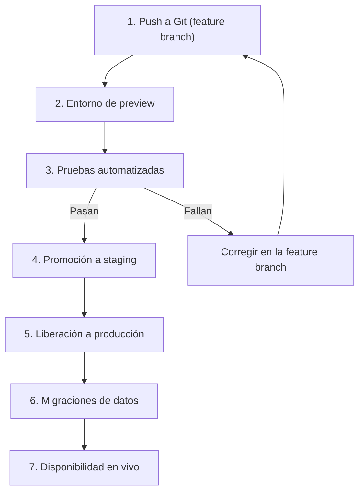

# DataCorp Analytics - Taller DataOps

## Actividad 1: Entornos aislados

### 1.1 Tabla de entornos

| Entorno | Propósito | Acceso | Datos | Infraestructura | Control de código |
|---|---|---|---|---|---|
| DEV | Experimentar y desarrollar modelos sin riesgo | Científicos de datos e ingenieros | Datos sintéticos o muestra anonimizada | Recursos pequeños y baratos | Ramas feature, push libre |
| QA | Validar que todo funciona antes de producción | Equipo de QA y pipeline automático | Copia anonimizada de producción | Réplica reducida de PROD | Solo entra código con Pull Request aprobado |
| PROD | Servir predicciones a clientes reales | Solo el pipeline automático | Datos reales con backups y cifrado | Alta disponibilidad y monitoreo | Rama main protegida |

**Justificación:** los incidentes actuales ocurrieron por trabajar directamente sobre producción. Separar los entornos y usar datos anonimizados en DEV y QA evita que un error afecte a los clientes.

### 1.2 Diagrama del flujo de un cambio

### 1.3 Escenario de error: el modelo falla en QA

**Escenario:** el modelo de predicción de ventas obtiene un error (RMSE) mayor al umbral permitido cuando se prueba en QA.

**Protocolo de actuación:**
1. El pipeline marca la etapa como fallida y **bloquea automáticamente** la promoción a PROD.
2. Se envía una alerta al equipo (Slack o correo).
3. Se crea un issue en GitHub con el log del error.
4. El científico de datos corrige el problema en su rama `feature/*`.
5. Al hacer push, las pruebas se ejecutan de nuevo desde cero.
6. Solo si todo pasa en QA, se aprueba el paso a producción.

**Herramientas y validaciones:**
- GitHub Actions o Jenkins: ejecutan el pipeline automáticamente.
- pytest: pruebas unitarias del código.
- Great Expectations: validación de calidad de los datos.
- MLflow: compara las métricas del modelo contra un umbral mínimo.
- Branch protection en GitHub: impide el merge si las pruebas fallan.
